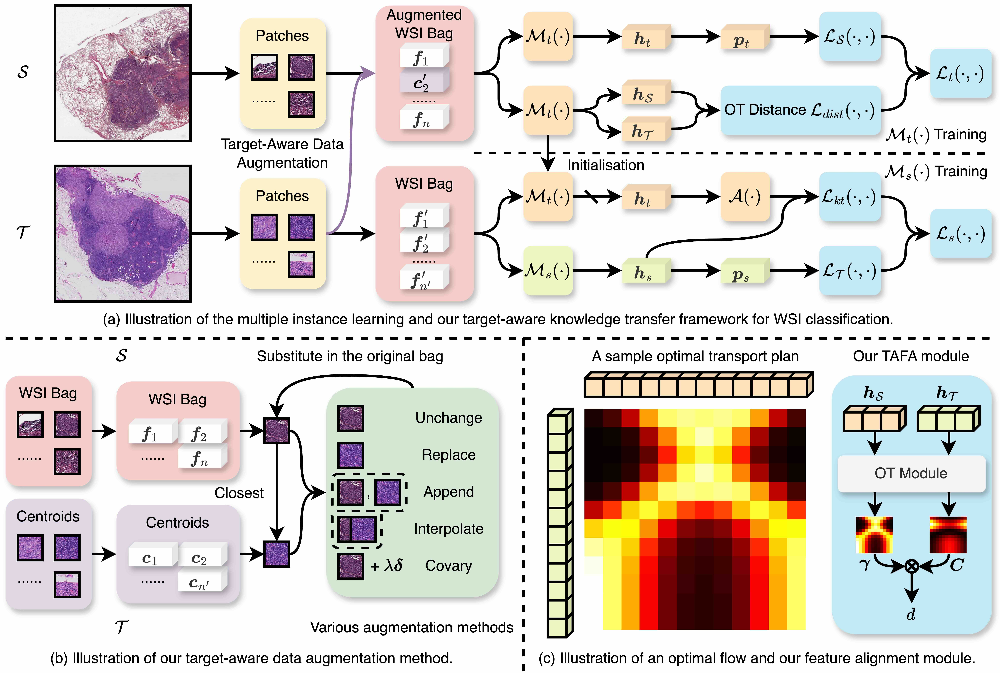

TAKT: Target-Aware Knowledge Transfer for Whole Slide Image Classification (MICCAI-2024)
===========
[Conghao Xiong](https://bearcleverproud.github.io/)\*, [Yi Lin](https://ianyilin.github.io)\*, [Hao Chen](https://cse.hkust.edu.hk/~jhc/), [Hao Zheng](https://scholar.google.com.hk/citations?user=LsJVCSoAAAAJ&hl=zh-CN), [Dong Wei](https://scholar.google.com.hk/citations?hl=zh-CN&user=njMpTPwAAAAJ), [Yefeng Zheng](https://sites.google.com/site/yefengzheng/), [Joseph J. Y. Sung](https://www.ntu.edu.sg/about-us/leadership-organisation/profiles/professor-joseph-sung) and [Irwin King](https://www.cse.cuhk.edu.hk/irwin.king/home)

[ArXiv](https://arxiv.org/abs/2303.05780) | [MICCAI](https://papers.miccai.org/miccai-2024/760-Paper2121.html)
\* Equal contribution



**Abstract:** Knowledge transfer from a source to a target domain is vital for whole slide image classification, given the limited dataset size due to high annotation costs. However, domain shift and task discrepancy between datasets can impede this process. To address these issues, we propose a Target-Aware Knowledge Transfer framework using a teacher-student paradigm, enabling a teacher model to learn common knowledge from both domains by actively incorporating unlabelled target images into the teacher model training. The teacher bag features are subsequently adapted to supervise the student model training on the target domain. Despite incorporating the target features during training, the teacher model tends to neglect them under inherent domain shift and task discrepancy. To alleviate this, we introduce a target-aware feature alignment module to establish a transferable latent relationship between the source and target features by solving an optimal transport problem. Experimental results show that models employing knowledge transfer outperform those trained from scratch, and our method achieves state-of-the-art performance among other knowledge transfer methods on various datasets, including TCGA-RCC, TCGA-NSCLC, and Camelyon16.

## Updates:
* 2024 July 11th: Created this repository and first push.
* 2024 Oct. 18th: Uploaded the codes and updated README.


## Pre-requisites:
* Linux (Tested on Ubuntu 18.04)
* NVIDIA GPU (Tested on V100)

## Dependencies:
```bash
torch
torchvision
scikit-survival
numpy
h5py
scipy
scikit-learning
pandas
nystrom_attention
admin_torch
pot
```

## Preprocessing
Thanks to the great work of [CLAM](https://github.com/mahmoodlab/CLAM/tree/master). In this step, we used codes of [CLAM](https://github.com/mahmoodlab/CLAM/tree/master). Please refer to their original repository on how to process your WSIs into features.

The data used for training, validation and testing are expected to be organized as follows:
```bash
DATA_ROOT_DIR/
    ├──DATASET_1_DATA_DIR/
        └── pt_files
                ├── slide_1.pt
                ├── slide_2.pt
                └── ...
    ├──DATASET_2_DATA_DIR/
        └── pt_files
                ├── slide_a.pt
                ├── slide_b.pt
                └── ...
    └──DATASET_3_DATA_DIR/
        └── pt_files
                ├── slide_i.pt
                ├── slide_ii.pt
                └── ...
    └── ...
```

### Preparation for Training
#### Generate Target Bag Centroids
The target features are first clustered using K-means and the cluster centers are used as target bag features. The command to generate the target bag features is as follows:
``` shell
python3 clustering_features_to_centroids.py --dataset_name DATASET_NAME --num_prototypes NUM_PROTOTYPES --num_shift_vectors NUM_SHIFT_VECTORS
```
This command will cluster each bag feature of ``DATASET_NAME`` into ``NUM_PROTOTYPES`` clusters and generate ``NUM_SHIFT_VECTORS`` shift vectors for each cluster. The saved folder can be found at this file, and you are free to modify the file paths and parameters if needed.

#### Mix Source Features and Target Centroids
Then we mix the source features and target centroids based on the distance between them. The command is as follows:
``` shell
python3 create_augmented_dataset.py --main_dataset DATASET_NAME --aux_dataset DATASET_NAME --mode MODE --rate RATE --strength STRENGTH
```

### GPU Training Using Our Default Settings
After preparing the data, we can train the model using the following commands.
#### Train the Teacher Model
First we need to train the teacher model on the augmented source domain. In this example, we use the TCGA-NSCLC dataset as the augmented source domain, and the Camelyon16 dataset as the target domain.

Use this command to train the teacher model:
``` shell
CUDA_VISIBLE_DEVICES=0 python3 main_with_augmentation.py --drop_out --early_stopping --lr 2e-4 --k 1 --coef COEF --label_frac 1.0 --exp_code TEACHER_EXP_CODE --bag_loss ce --inst_loss svm --task task_2_tcga_nsclc --model_type clam_sb --log_data --subtyping --data_root_dir DATA_ROOT_DIR --seed 0
```

#### Train the Student Model
We then train the student model on the target domain using the teacher model as the supervision.
Use the following command to train the student model:

``` shell
CUDA_VISIBLE_DEVICES=0 python3 knowledge_transfer_main.py --drop_out --early_stopping --lr 2e-4 --k 1 --label_frac 1.0 --bag_loss ce --inst_loss svm --task task_3_camelyon --model_type clam_sb --log_data --data_root_dir DATA_ROOT_DIR --teacher_ckpt results/TEACHER_EXP_CODE --exp_code STU_EXP_CODE --teacher_n_class 2 --teacher_model_size small --fine_tune --subtyping --seed 0
```

## Issues
- Please report all issues on GitHub.

## Acknowledgement
This repository is built upon [CLAM](https://github.com/mahmoodlab/CLAM/tree/master) and [MOTCat](https://github.com/Innse/MOTCat). Thanks again for their great works!

## Reference
If you find our work useful in your research or if you use parts of this code please consider citing our [paper](https://papers.miccai.org/miccai-2024/760-Paper2121.html):

```
@InProceedings{Xio_TAKT_MICCAI2024,
        author = { Xiong, Conghao and Lin, Yi and Chen, Hao and Zheng, Hao and Wei, Dong and Zheng, Yefeng and Sung, Joseph J. Y. and King, Irwin},
        title = { { TAKT: Target-Aware Knowledge Transfer for Whole Slide Image Classification } },
        booktitle = {proceedings of Medical Image Computing and Computer Assisted Intervention -- MICCAI 2024},
        year = {2024},
        publisher = {Springer Nature Switzerland},
        volume = {LNCS 15004},
        month = {October},
        page = {pending}
}

```
